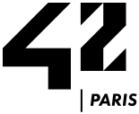
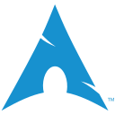

<h2><em><strong>IT student at </em></strong></h2>

  
  

    <h3 align="left"><strong>Learn</strong></h3>
    <h4><strong>System programming:</strong></h4>
    <ul>
      <li>Multiprocessing | Multithreading (POSIX)</li>
      <li>Minishell (Bash mirror)</li>
    </ul>
    <h4><strong>Graphic programming:</strong></h4>
    <ul>
      <li>2D Game | Wireframe | Fractal</li>
      <li>Raycasting | Raytracing</li>
    </ul>
    <h4><strong>Network programming:</strong></h4>
    <ul>
      <li>Web server | IRC chat</li>
    </ul>
    <h4><strong>System administration:</strong></h4>
    <ul>
      <li>Linux distribution setup</li>
      <li>Docker deployment</li>
    </ul>
    <h4><strong>Full-stack programming:</strong></h4>
    <ul>
      <li>Web application (Pong game)</li>
    </ul>
  

<h2></h2>

  

    <h3><strong>CTF</strong></h3>
    <a href="https://www.root-me.org/anska"><strong>root-me</strong></a>
     
    <a href="https://tryhackme.com/p/Anska"><strong>tryhackme</strong></a>
     
    <a href="https://app.hackthebox.com/users/2283278"><strong>hackthebox</strong></a>
     
    <a href="https://cryptohack.org/user/anska/"><strong>cryptohack</strong></a>
     
    <a href="https://www.42ctf.org/en/accounts/profile/anska?"><strong>42ctf</strong></a>
    <h3><strong>Algo</strong></h3>
    <a href="https://leetcode.com/u/anska-lc/"><strong>leetcode</strong></a>
     
    <a href="https://www.codingame.com/profile/6160140ea161f06ea18df960622d480e6694884"><strong>codingame</strong></a>
     
    <a href="https://www.codewars.com/users/anska"><strong>codewars</strong></a>
     
    <h3><strong>Technology</strong></h3>
    <h4><strong>Language</strong></h4>
    &nbsp;
    
    &nbsp;
    
    &nbsp;
    
    &nbsp;
    
    &nbsp;
    
    &nbsp;
    
    <h4><strong>Platform</strong></h4>
    &nbsp;
    
    &nbsp;
    
    &nbsp;
    
    &nbsp;
    
    &nbsp;
    
    <h4><strong>Tool</strong></h4>
    &nbsp;
    
    &nbsp;
    
    &nbsp;
    
    &nbsp;
    
    &nbsp;
    
    &nbsp;
    
     

<h2></h2>

  <a href="https://anska.dev"><strong>anska.dev</strong></a>

